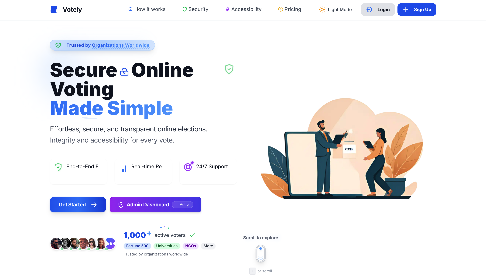
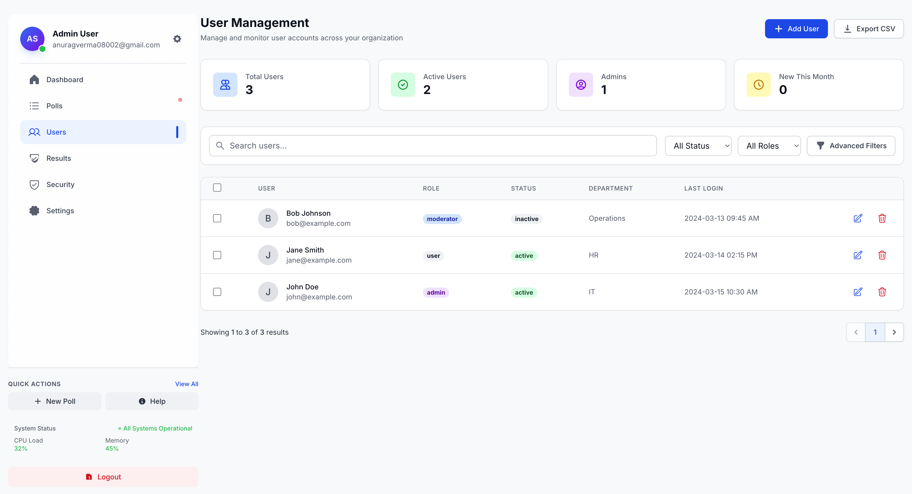
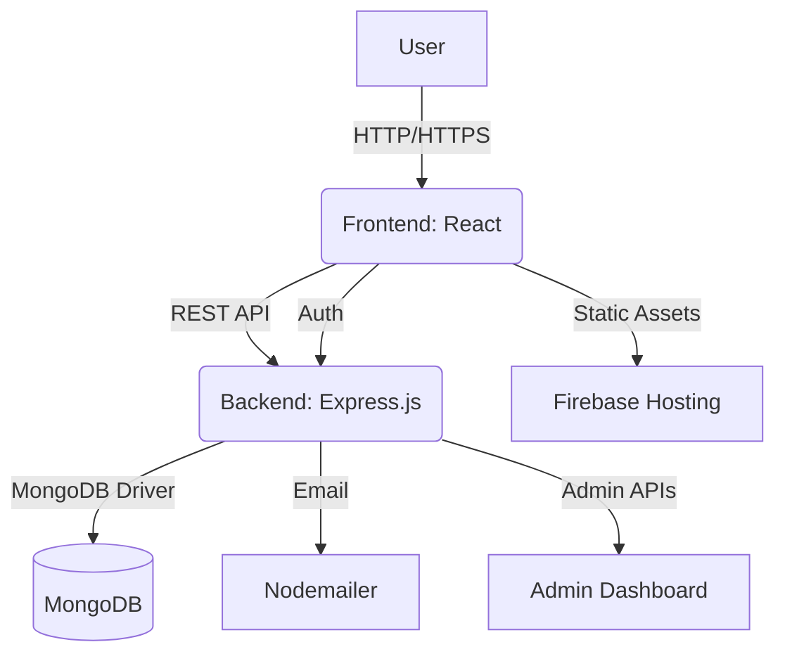

# Votely 🗳️

[](LICENSE)
[](https://github.com/yourusername/votely/issues)
[](https://github.com/yourusername/votely/pulls)
[](https://firebase.google.com/)

---

> **Votely** is a modern, full-stack web application for creating, sharing, and participating in polls. Designed for scalability, accessibility, and real-time engagement, Votely empowers communities, teams, and organizations to make decisions together.

---

## 🚀 Table of Contents
- [Features](#features)
- [Screenshots](#screenshots)
- [Tech Stack](#tech-stack)
- [Architecture](#architecture)
- [Quick Start](#quick-start)
- [Folder Structure](#folder-structure)
- [API Overview](#api-overview)
- [Contributing](#contributing)
- [License](#license)
- [Contact](#contact)

---

## ✨ Features

- 📝 **Create & Manage Polls** — Intuitive poll creation with images, options, and deadlines
- 🔒 **Authentication** — Secure user registration, login, and profile management
- 📊 **Real-Time Voting** — Live updates of poll results as users vote
- 💬 **Comments** — Engage in discussions on each poll
- 🛡️ **Admin Dashboard** — Manage users, polls, and monitor activity
- 📱 **Responsive Design** — Mobile-first, accessible, and fast
- 🌗 **Dark Mode** — Seamless light/dark theme switching
- 🔗 **Social Sharing** — Share polls via social media
- 📧 **Email Notifications** — Stay updated on poll activity
- 🏆 **Gamification** — Activity tracking and leaderboards (optional)
- 🧑‍💻 **Developer Friendly** — Modular, well-documented codebase

---

## 📸 Screenshots

| Landing Page | Poll Voting | Admin Dashboard |
|:---:|:---:|:---:|
|  |  |  |

---

## 🛠️ Tech Stack

- **Frontend:** React, Vite, Tailwind CSS
- **State Management:** React Context API
- **Backend:** Node.js, Express.js
- **Database:** MongoDB
- **Authentication:** JWT, bcrypt
- **Email:** Nodemailer
- **Deployment:** Firebase (Frontend), Render/Heroku (Backend)
- **Other:** ESLint, Prettier, Firebase (for hosting/static assets)

---

## 🏗️ Architecture



---

## ⚡ Quick Start

### 1. Clone the Repository
```bash
git clone https://github.com/yourusername/votely.git
cd votely
```

### 2. Backend Setup
```bash
cd backend
npm install
# Configure your .env (see .env.example)
npm start
```

### 3. Frontend Setup
```bash
cd ../frontend
npm install
npm run dev
```

### 4. Deploy to Firebase
```bash
# Make sure you have the Firebase CLI installed and initialized
firebase login
firebase init
firebase deploy
```

### 5. Access the App
- Frontend: [Your Firebase Hosting URL]
- Backend API: [http://localhost:5000](http://localhost:5000)

---

## 📁 Folder Structure

```
votely/
├── backend/
│   ├── src/
│   │   ├── controllers/      # Route controllers
│   │   ├── middleware/       # Express middlewares
│   │   ├── models/           # Mongoose models
│   │   ├── routes/           # API routes
│   │   ├── utils/            # Utility functions
│   │   └── server.js         # App entry point
│   └── uploads/              # Uploaded images
├── frontend/
│   ├── src/
│   │   ├── components/       # React components
│   │   ├── context/          # Context providers
│   │   ├── hooks/            # Custom hooks
│   │   ├── pages/            # Page components
│   │   └── utils/            # Frontend utilities
│   └── public/               # Static assets
└── readme.md
```

---

## 📚 API Overview

> _See full API docs in `/backend/src/routes/`_

### Auth
- `POST /api/auth/register` — Register new user
- `POST /api/auth/login` — Login
- `GET /api/profile` — Get user profile

### Polls
- `GET /api/polls` — List all polls
- `POST /api/polls` — Create poll
- `GET /api/polls/:id` — Poll details
- `POST /api/polls/:id/vote` — Vote on poll

### Comments
- `GET /api/polls/:id/comments` — List comments
- `POST /api/polls/:id/comments` — Add comment

### Admin
- `GET /api/admin/users` — List users
- `DELETE /api/admin/users/:id` — Delete user

---

## 🤝 Contributing

1. Fork the repo
2. Create your feature branch (`git checkout -b feature/YourFeature`)
3. Commit your changes (`git commit -am 'Add new feature'`)
4. Push to the branch (`git push origin feature/YourFeature`)
5. Open a Pull Request

> Please read [CONTRIBUTING.md](CONTRIBUTING.md) for more details.

---

## 📄 License

This project is licensed under the MIT License. See the [LICENSE](LICENSE) file for details.

---

## 📬 Contact & Acknowledgments

- **Author:** [Anurag Verma](https://github.com/Anurag-amrev-7557)
- **Project Link:** [https://github.com/Anurag-amrev-7557/votely](https://github.com/Anurag-amrev-7557/votely)
- **Email:** mindreaders7557@gmail.com

> Special thanks to all contributors and the open-source community!
